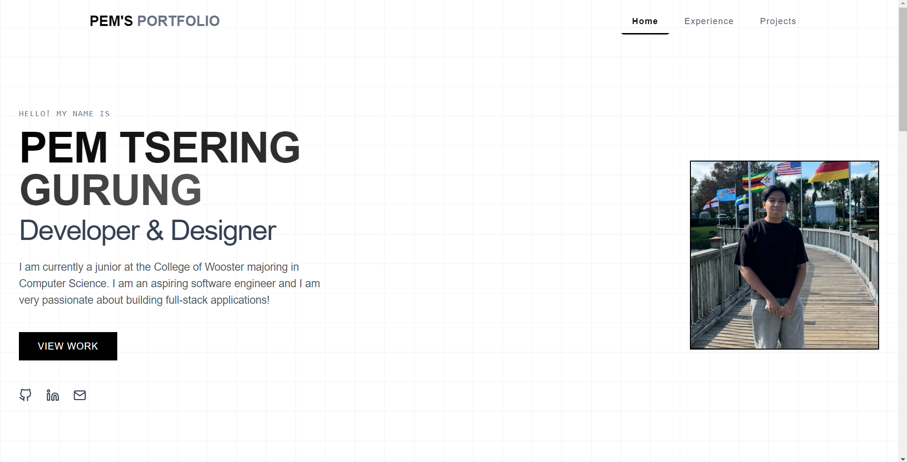

# Pem Tsering Gurung's Portfolio Website

A modern, responsive portfolio website built with React and Vite showcasing my skills, experience, and projects.



## 🚀 Features

- **Clean Modern Design**: Minimalist interface with dark/light mode support
- **Responsive Layout**: Optimized for all device sizes from mobile to desktop
- **Animated Elements**: Smooth transitions and animations using Framer Motion
- **Interactive Sections**:
  - **Hero**: Introduction with social media links
  - **Experience**: Professional work history at The College of Wooster
  - **Projects**: Showcase of development work with live demos and GitHub repositories

## 💻 Project Showcase

- **Fire Rescue Resource Allocator**: An interactive mapping tool for optimizing emergency response in Los Angeles by visualizing fire station locations and incidents
- **Pem's Room Tracking Website**: A web application for managing and tracking room availability using Vite and React

## 🛠️ Technologies Used

- **React**: Frontend library for building the UI
- **Vite**: Next-generation frontend tooling
- **Framer Motion**: Animation library for smooth transitions
- **Tailwind CSS**: Utility-first CSS framework
- **React Icons**: Icon library for social media and navigation elements

## 🚀 Installation & Setup

1. **Clone the repository**
   ```bash
   git clone https://github.com/pemtseringgurung/portfolio-website.git
   cd portfolio-website
   ```

2. **Install dependencies**
   ```bash
   npm install
   ```

3. **Run development server**
   ```bash
   npm run dev
   ```

4. **Build for production**
   ```bash
   npm run build
   ```

## 🔧 Customization

The site is fully customizable:

- **Content**: Update the text in each component to reflect your personal information
- **Images**: Replace images in the `/src/images/` directory
- **Projects**: Modify the projects array in `src/components/Projects.jsx`
- **Experience**: Update work history in `src/components/Experience.jsx`
- **Styling**: Adjust the Tailwind classes for personalized styling

## 📱 Responsive Design

The website is fully responsive with custom layouts for:
- Mobile devices
- Tablets
- Desktop computers

## 🚀 Deployment

This site is deployed on Vercel. You can deploy your own version using:
- Vercel
- Netlify
- GitHub Pages

## 📞 Contact

Feel free to reach out:
- GitHub: [https://github.com/pemtseringgurung](https://github.com/pemtseringgurung)
- LinkedIn: [https://www.linkedin.com/in/pemgurung/](https://www.linkedin.com/in/pemgurung/)
- Email: [pemgurung541@gmail.com](mailto:pemgurung541@gmail.com)

---

Built with ❤️ by Pem Tsering Gurung
